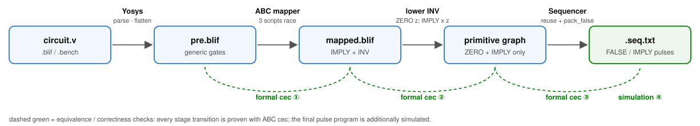
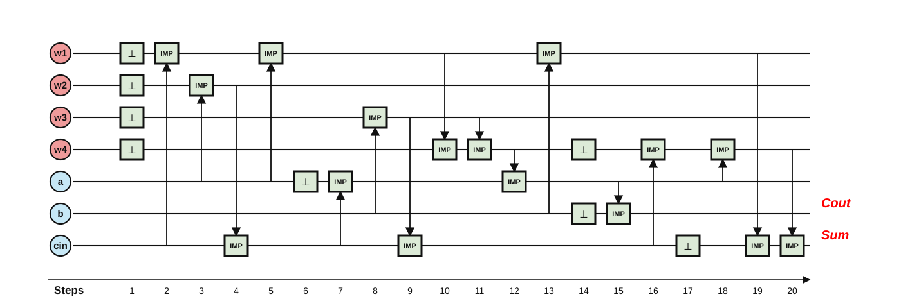
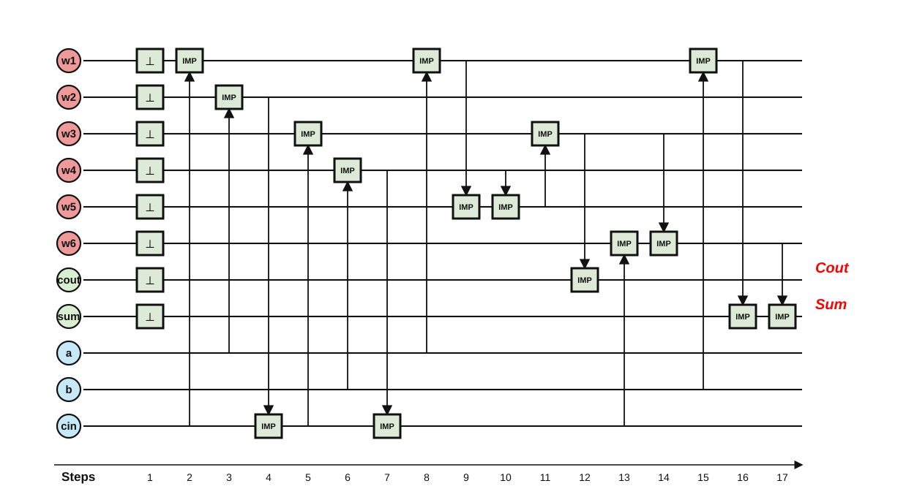

# IMPLY Synthesis — Project 9, Memory-Centric Computing (SS 2026)

Supervisor: Fabian Seiler · Heidelberg University

**A compiler from any small combinational circuit (Verilog / BLIF / BENCH) to a
formally verified pulse program for one memristive crossbar row.**

> full adder: **20 steps / 7 cells** · c17: **15 steps / 8 cells** ·
> all **11 / 11** ISCAS'85 circuits compile and verify end-to-end.

## 1. The idea in one paragraph

A memristive crossbar can compute inside the memory array with just two
physical operations: **FALSE** (a reset pulse that writes 0 into any set of
cells at once) and **IMPLY**(a, b) = ¬a ∨ b (a stateful pulse that overwrites
cell *b*). Both operations are destructive and everything lives in one row of
cells, so turning a logic circuit into a short, correct pulse sequence is a
real scheduling problem. This repository automates the whole path and proves
each step correct.

## 2. Pipeline



| stage | tool | what happens |
|---|---|---|
| frontend | Yosys | parse, flatten, lower to generic single-bit gates |
| mapping | ABC (`yosys-abc`) | map onto `abc_imply.genlib`; 3 scripts race, lowest cost wins |
| lowering | `compile.py` | every `INV x` becomes `ZERO z; IMPLY x z` — only project primitives remain |
| scheduling | `sequencer.py` | linear pulse program with cell reuse and optimal FALSE packing |
| verification | ABC `cec` + `imply_sim.py` | ①–③ formal equivalence, ④ pulse-level simulation |

Driver: `synthesis/compile.py` (one circuit, prints PASS/FAIL);
`synthesis/run_iscas85.py` batches it over the checked-in ISCAS'85 set.

## 3. What the output looks like

The 20-step full-adder schedule, exactly as generated by the compiler
(rows = crossbar cells, columns = pulses; `⊥` = FALSE reset, boxes = IMPLY):



Every compiled circuit gets this diagram automatically, next to its
`.seq.txt`, in `synthesis/compiled/<circuit>/`.

## 4. Scheduling modes: two opt-in switches

| | default (min cells) | `--unlimited-cells` (min steps) |
|---|---|---|
| **idea** | reuse dead cells, narrowest row | fresh cell per value → all resets pack into **one upfront FALSE pulse** |
| **full adder** |  |  |

`--preserve-inputs` additionally keeps every input cell readable to the end
(the supervisor-requested corner). All four combinations, measured:

| circuit | default | `--preserve-inputs` | `--unlimited-cells` | both |
|---|---:|---:|---:|---:|
| `full_adder` | **20 / 7** | 20 / 10 | **17** / 11 | 18 / 12 |
| `c17` | **15 / 8** | 14 / 10 | **13** / 11 | 13 / 11 |

*(steps / cells; commands: `python3 compile.py circuits/arithmetic/full_adder.v [--preserve-inputs] [--unlimited-cells]`)*

Details and the latency/area trade-off analysis:
[docs/document/false_packing_report.md](docs/document/false_packing_report.md).

## 5. Results on ISCAS'85

All 11 circuits, naive topological emission vs. optimized schedule
(regenerate anytime: `python3 synthesis/run_iscas85.py synthesis/circuits/ISCAS85`):

| circuit | naive steps | opt steps | cells | steps saved |
|---|---:|---:|---:|---|
| `c17` | 54 | **15** | 8 | `██████████████░░░░░` 72% |
| `c432` | 971 | **243** | 72 | `███████████████░░░░` 75% |
| `c499` | 2901 | **885** | 228 | `██████████████░░░░░` 69% |
| `c880` | 2100 | **631** | 160 | `██████████████░░░░░` 70% |
| `c1355` | 2732 | **888** | 229 | `█████████████░░░░░░` 67% |
| `c1908` | 2621 | **807** | 208 | `██████████████░░░░░` 69% |
| `c2670` | 3914 | **1235** | 367 | `██████████████░░░░░` 68% |
| `c3540` | 6188 | **1981** | 323 | `██████████████░░░░░` 68% |
| `c5315` | 9005 | **2867** | 640 | `██████████████░░░░░` 68% |
| `c6288` | 12422 | **4616** | 741 | `█████████████░░░░░░` 63% |
| `c7552` | 10014 | **3190** | 717 | `██████████████░░░░░` 68% |

Schedule diagrams for all 11 circuits:
[docs/iscas85_schedules/](docs/iscas85_schedules/README.md).
Comparison against SIMPLER MAGIC (TCAD'20), including where we win on latency
(`c432`: 218 vs 237 cycles) and on cells (`c2670`: 367 vs 383):
[docs/document/comparison_simpler.md](docs/document/comparison_simpler.md).

## 6. Verification: every number above is checked

Each compiled circuit passes four independent checks — three formal ABC `cec`
equivalences (source == mapping == primitive graph == pulse sequence) plus a
truth-table (small circuits) or fixed-seed sampled (large circuits) simulation
of the emitted pulse program. FALSE packing is not just heuristic: it is
provably minimal for the emitted IMPLY order (minimum interval piercing —
[proof](docs/document/false_packing_report.md)).

## 7. Quick start

| requirement | version used here | install (macOS) |
|---|---|---|
| Python | ≥ 3.12 | `brew install python` |
| Yosys (+ `yosys-abc`) | 0.66 | `brew install yosys` |
| pytest (tests only) | any recent | `pip install pytest` |

```bash
python3 imply_sim.py                                    # simulator self-test → ALL PASS
cd synthesis
python3 -m pytest tests                                 # 15 unit tests
python3 compile.py circuits/gates/not1.v                # smallest example: FALSE; IMPLY
python3 compile.py circuits/arithmetic/full_adder.v     # 20 steps / 7 cells, 5 checks PASS
```

## 8. Repository map

```text
src/
├── imply_sim.py               logic-level simulator for one crossbar row (IMPLY + FALSE)
├── synthesis/
│   ├── compile.py             one-circuit flow: Yosys → ABC → lowering → sequence (+ checks)
│   ├── sequencer.py           the scheduler: cell reuse, inverse caching, optimal FALSE packing
│   ├── run_iscas85.py         batch compile.py over circuits/ISCAS85, writes results tables
│   ├── imply.genlib           project primitive library: IMPLY + ZERO (nothing else)
│   ├── abc_imply.genlib       ABC adapter library (+ INV cost 2, ONE), expanded after mapping
│   ├── utils/render_schedule_svg.py    .seq.txt → schedule diagram (SVG)
│   ├── verify/verify_netlist.py        BLIF parsing + netlist evaluation
│   ├── verify/sim_sanity.py            pulse-program simulation cross-check
│   ├── circuits/              gates/ arithmetic/ combinational/ ISCAS85/
│   ├── tests/                 pytest suite (sequencer edge cases, renderer, runner)
│   └── compiled/              generated per-circuit artifacts (gitignored)
├── output/                    generated result tables (gitignored)
└── docs/                      worked examples, reports, curated figures → docs/README.md
```

Generated files never land in `docs/`: `compile.py` writes to
`synthesis/compiled/<circuit>/`, `run_iscas85.py` to `output/iscas85/` — both
gitignored. A figure only enters `docs/assets/` when a README deliberately
embeds it.

## 9. Reading guide

| start here | what you get |
|---|---|
| [docs/full_adder/README.md](docs/full_adder/README.md) | the full adder walked through every stage, with real artifacts |
| [docs/c17/README.md](docs/c17/README.md) | same exercise on the first ISCAS'85 circuit |
| [docs/document/sequencing_optimization_report.md](docs/document/sequencing_optimization_report.md) | how the schedule went 26 → 20 steps (incl. ISCAS'85 before/after) |
| [docs/document/false_packing_report.md](docs/document/false_packing_report.md) | optimal FALSE packing + scheduling corners |
| [docs/document/comparison_simpler.md](docs/document/comparison_simpler.md) | head-to-head vs SIMPLER MAGIC (TCAD'20) |
