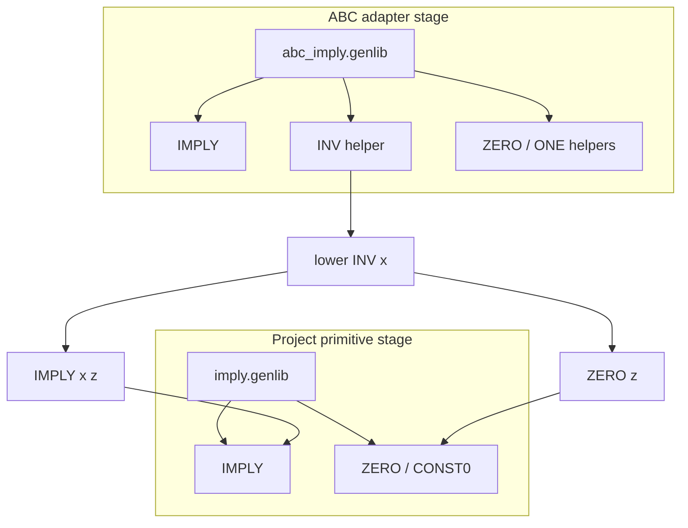
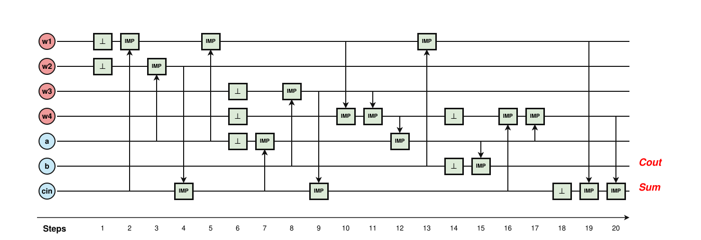
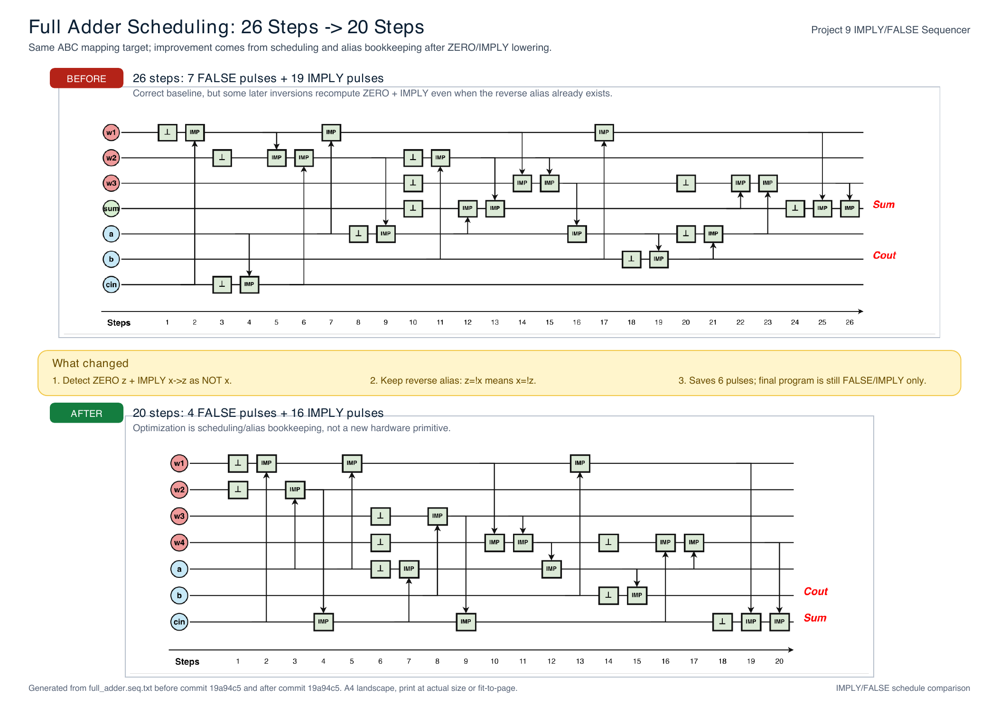

# IMPLY synthesis for Project 9

This is my current public code for Project 9 in Memory-Centric Computing
(SS 2026, Heidelberg University).

The goal is to take a small combinational circuit and turn it into a sequence
of memristive `FALSE` and `IMPLY` operations. The repository is intentionally
conservative: it contains the simulator, the ABC mapping setup, the sequencer,
the single-circuit compile flow, and the ISCAS'85 runner/report used for the
latest supervisor discussion. Random fuzzing, ATOMIC export, and robustness
experiments are still local work and are not included in this snapshot.

Supervisor: Fabian Seiler

## visual summary

### What changed after the feedback

| Feedback / concern | Updated result |
|---|---|
| The scheduling was hard to understand from code alone. | `compile.py` now builds an explicit ZERO/IMPLY dependency graph before sequencing. |
| The target primitives should be `CONST0` and `IMPLY`. | `synthesis/imply.genlib` is now the project-facing primitive library with only `ZERO` and `IMPLY`. |
| ABC still needs helper cells to map reliably. | `synthesis/abc_imply.genlib` is kept only as an ABC adapter; helpers are expanded before sequencing. |
| FALSE / ZERO structure should be visible to the scheduler. | The sequencer recognizes single-use `ZERO + IMPLY` inversion shapes and keeps useful inverse aliases alive. |
| Results should be easy to inspect visually. | The README now shows the pipeline, lowering rule, schedule graph, benchmark table, and verification chain. |
| Benchmarks should move toward ISCAS'85. | `c17.v` is kept as the smoke test, and `docs/sequencing_optimization_report.md` summarizes a full ISCAS'85 run. |

### Current pipeline


### Why there are two libraries

ABC's mapper expects helper cells such as an inverter. The project result still
uses only the required primitives by expanding every helper immediately after
mapping.



### Smoke results

| Circuit | Role | ABC adapter map | Primitive dependency graph | Optimized sequence | Status |
|---|---|---:|---:|---:|---|
| `full_adder` | main explanatory case | 8 IMPLY + 4 INV | 12 IMPLY + 4 ZERO | 20 steps / 7 cells | PASS |
| `c17` | first ISCAS'85 sanity check | 6 IMPLY + 4 INV | 10 IMPLY + 4 ZERO | 15 steps / 8 cells | PASS |

### Full-adder operation schedule

This is an **operation schedule diagram**: rows are memristor cells, columns are
pulse steps, `⊥` boxes are FALSE resets, and `IMP` boxes are IMPLY operations.
The visual style follows the C64 paper's scheduling graph: each horizontal line
shows one memristor's state over time, small boxes mark operations, local arrows
show the source-to-destination information flow, and red labels mark final
outputs. The figure is generated from the actual `compile.py` sequence output.



### Printable 26-to-20 comparison handout

For the supervisor discussion, this A4 printout places the old 26-step schedule
and the optimized 20-step schedule on one page, with the exact scheduling change
called out in the middle.

[Download the A4 PDF](docs/full_adder_26_to_20_a4.pdf)



The sequencing optimization and the ISCAS'85 before/after table are summarized
in [`docs/sequencing_optimization_report.md`](docs/sequencing_optimization_report.md).

### Verification chain


| Check | What it proves | Current result |
|---|---|---|
| `python3 -m pytest synthesis/tests` | unit behavior for sequencer, dependency graph, benchmark runner, and schedule renderer helpers | 17 passed |
| `python3 compile.py circuits/full_adder.v` | full adder source, primitive graph, and sequence are equivalent | PASS |
| `python3 compile.py circuits/c17.v` | first ISCAS'85 smoke circuit is equivalent through the same flow | PASS |
| `bash run_synth.sh && python3 verify_netlist.py` | all local ABC adapter netlists match Python golden models | all OK |

## what currently works

```text
Verilog / BLIF / BENCH
  -> Yosys
  -> generic BLIF
  -> ABC with synthesis/abc_imply.genlib
  -> adapter IMPLY/INV netlist
  -> ZERO/IMPLY dependency graph
  -> synthesis/sequencer.py
  -> IMPLY/FALSE sequence
  -> simulator sanity check
  -> ABC cec equivalence checks
```

The project-facing primitive library is intentionally small:

```genlib
GATE IMPLY  1  O=!a+b;
GATE ZERO   0  O=CONST0;
```

ABC's mapper currently expects helper cells such as `INV`, so the code uses
`synthesis/abc_imply.genlib` as a tool adapter. Immediately after mapping,
`compile.py` expands every helper back into a primitive dependency graph:
`INV x` becomes `ZERO z; IMPLY x z`. The final graph and pulse program therefore
use only the operations required by the project: `FALSE/CONST0` and `IMPLY`.

## files

| path | role |
|---|---|
| `imply_sim.py` | logic-level simulator for one crossbar row |
| `synthesis/imply.genlib` | project primitive library: `ZERO` + `IMPLY` |
| `synthesis/abc_imply.genlib` | ABC adapter library used before primitive expansion |
| `synthesis/dependency_graph.py` | expands helper gates and writes dependency tree/DOT views |
| `synthesis/render_schedule_svg.py` | renders `.seq.txt` pulse programs as SVG operation schedule diagrams |
| `synthesis/run_synth.sh` | batch front end for the small Verilog examples |
| `synthesis/run_iscas85.py` | runs `compile.py` over an external ISCAS'85 Verilog directory |
| `synthesis/verify_netlist.py` | checks mapped netlists against Python golden models |
| `synthesis/sequencer.py` | lowers primitive dependency graphs to pulse programs |
| `synthesis/compile.py` | one-circuit demo flow with ABC `cec` checks |
| `synthesis/circuits/` | small Verilog inputs |
| `synthesis/demo/` | extra demo inputs for `compile.py` |
| `synthesis/tests/` | tests for the public pieces |

## quick run

```bash
# simulator self-test
python3.14 imply_sim.py

# compile the smallest example
cd synthesis
python3.14 compile.py circuits/not1.v
cat compiled/not1/not1.seq.txt

# a less trivial example
python3.14 compile.py circuits/full_adder.v
```

For `not1.v`, the final sequence should be:

```text
FALSE [1]
IMPLY 0 -> 1
```

If input `a` is in cell `0`, resetting cell `1` and then applying
`IMPLY 0 -> 1` stores `NOT a` in cell `1`.

For `full_adder.v`, `compile.py` also writes:

- `compiled/full_adder/dependency_tree.txt`
- `compiled/full_adder/dependency_graph.dot`

These files show the explicit primitive graph used by the sequencer.

The README schedule figure can be regenerated with:

```bash
python3 synthesis/render_schedule_svg.py \
  synthesis/compiled/full_adder/full_adder.seq.txt \
  docs/full_adder_schedule.svg \
  --drawio docs/full_adder_schedule.drawio \
  --export-with-drawio \
  --title "Full adder IMPLY/FALSE schedule"
```

## local toolchain

- Python 3.14
- Yosys
- ABC through `yosys-abc`

Generated directories such as `synthesis/pre/`, `synthesis/out/`, and
`synthesis/compiled/` are ignored. They can be regenerated from the source
files.
