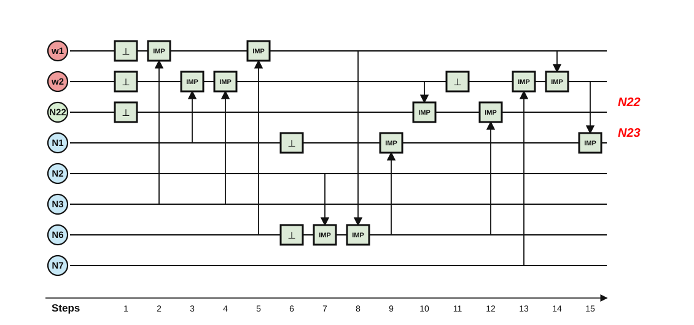

# Worked example: `c17` (first ISCAS'85 circuit)

Companion to the full walkthrough in [../full_adder/README.md](../full_adder/README.md). `c17` is
the smallest ISCAS'85 benchmark — six NAND gates — and serves as the smoke
test that the flow is not full-adder-specific. Everything below comes from
`python3 compile.py circuits/combinational/c17.v`.

## 1. Source

```verilog
module c17(input N1, N2, N3, N6, N7, output N22, N23);
  wire N10 = ~(N1 & N3);
  wire N11 = ~(N3 & N6);
  wire N16 = ~(N2 & N11);
  wire N19 = ~(N11 & N7);
  assign N22 = ~(N10 & N16);
  assign N23 = ~(N16 & N19);
endmodule
```

## 2. Through the pipeline

| stage | result |
|---|---|
| ABC mapping (`abc_imply.genlib`) | 6 IMPLY + 4 INV |
| primitive lowering (INV → ZERO + IMPLY) | 10 IMPLY + 4 ZERO |
| sequencer, default min-cells mode | naive 54 → **15 steps / 8 cells** |
| verification | 3× formal `cec` + exhaustive 32-vector simulation, all PASS |

A NAND-only circuit maps nicely onto IMPLY: `¬(x ∧ y) = IMPLY(x, ¬y)`, so
each NAND costs one inversion plus one IMPLY, and inversions that feed
several gates are shared.

## 3. The 15-step pulse program

Inputs start in cells 0–4 (`N1 N2 N3 N6 N7`); outputs end in cell 7 (`N22`)
and cell 0 (`N23`):

```text
 1  FALSE [5, 6, 7]      6  FALSE [0, 3]       11  FALSE [6]
 2  IMPLY 2 -> 5         7  IMPLY 1 -> 3       12  IMPLY 3 -> 7
 3  IMPLY 0 -> 6         8  IMPLY 5 -> 3       13  IMPLY 4 -> 6
 4  IMPLY 2 -> 6         9  IMPLY 3 -> 0       14  IMPLY 5 -> 6
 5  IMPLY 3 -> 5        10  IMPLY 6 -> 7       15  IMPLY 6 -> 0
```

The same scheduling tricks as in the full-adder walkthrough are visible at a
glance: 6 resets are packed into just 3 FALSE pulses, and the input cells for
`N1` and `N6` are recycled at step 6 the moment their values are dead.

## 4. Operation schedule diagram



Schedule diagrams for the other ten ISCAS'85 circuits regenerate next to
their sequences in `synthesis/compiled/<circuit>/` when compiled. The full
result table (all 11 circuits) regenerates in one command:
`python3 synthesis/run_iscas85.py synthesis/circuits/ISCAS85`.

## 5. Reproduce

```bash
cd synthesis
python3 compile.py circuits/combinational/c17.v
cat compiled/c17/c17.seq.txt
```
