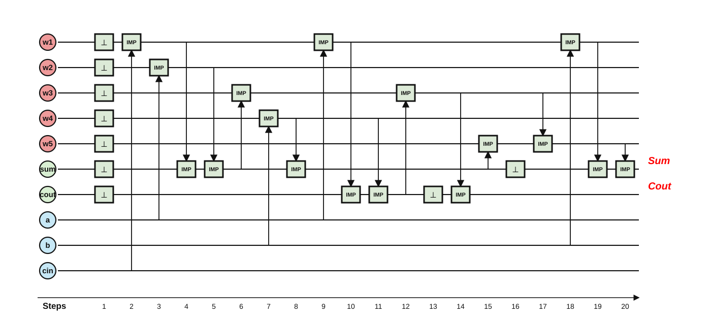
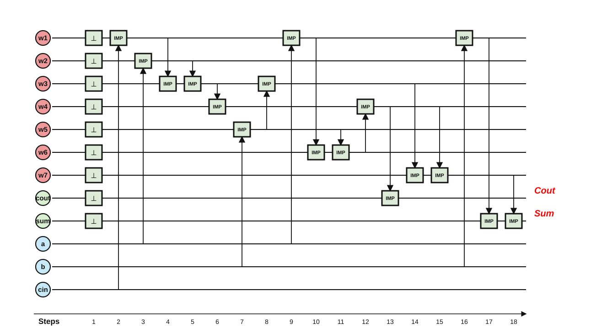

# Worked example: `full_adder`, stage by stage

This page follows one circuit — the 1-bit full adder from the lecture — through
every stage of the pipeline, using the real artifacts that
`python3 compile.py circuits/arithmetic/full_adder.v` writes into
`synthesis/compiled/full_adder/`. A second, shorter example (`c17`) is in
[c17/README.md](../c17/README.md).

```text
full_adder.v ─▶ pre.blif ─▶ mapped.blif ─▶ primitive graph ─▶ 20-step pulse program
   (source)     (Yosys)     (ABC, §3)       (lowering, §4)     (sequencer, §5–§7)
```

## 1. Source

```verilog
module full_adder(input a, b, cin, output sum, cout);
  assign sum  = a ^ b ^ cin;
  assign cout = (a & b) | (a & cin) | (b & cin);
endmodule
```

## 2. Yosys frontend → `pre.blif`

Yosys parses the Verilog, flattens it, and lowers it to generic single-bit
gates, written as BLIF truth tables. Two rows of `pre.blif` are enough to see
the format (`10 1` reads: input pattern `10` → output `1`):

```blif
.names a b $xor$full_adder.v:2$1_Y
10 1
01 1        ← together: XOR(a, b)
```

Nothing here is IMPLY-specific yet — this is plain technology-independent
logic.

## 3. ABC mapping → `mapped.blif` (8 IMPLY + 4 INV)

ABC maps the generic gates onto the adapter library `abc_imply.genlib`
(IMPLY, plus an INV helper at cost 2). Three optimization scripts are run and
the cheapest result wins. The full mapped netlist:

```blif
.gate INV   a=cin O=new_n6          # n6  = ¬cin
.gate IMPLY a=new_n6 b=a O=new_n7   # n7  = a ∨ cin
.gate INV   a=new_n7 O=new_n8       # n8  = ¬(a ∨ cin)          (NOR)
.gate IMPLY a=new_n8 b=b O=new_n9   # n9  = a ∨ b ∨ cin
.gate IMPLY a=a b=new_n6 O=new_n10  # n10 = ¬(a ∧ cin)          (NAND)
.gate IMPLY a=new_n10 b=b O=new_n11 # n11 = (a ∧ cin) ∨ b
.gate IMPLY a=new_n11 b=new_n8 O=new_n12
.gate INV   a=new_n12 O=cout        # cout = majority(a, b, cin)
.gate IMPLY a=new_n9 b=cout O=new_n14
.gate IMPLY a=b b=new_n10 O=new_n15 # n15 = ¬(a ∧ b ∧ cin)
.gate INV   a=new_n15 O=new_n16     # n16 = a ∧ b ∧ cin
.gate IMPLY a=new_n14 b=new_n16 O=sum
```

Reading the two outputs as human logic (`IMPLY(x, y) = ¬x ∨ y`):

- **cout** = ((a ∧ cin) ∨ b) ∧ (a ∨ cin) = the classic majority function;
- **sum** = (a ∨ b ∨ cin) ∧ ¬cout ∨ (a ∧ b ∧ cin) — "at least one input is 1
  but there is no carry, or all three are 1", the textbook 3-input XOR
  decomposition.


## 4. Lowering → primitive graph (12 IMPLY + 4 ZERO)

The hardware has no INV gate. Each `INV x` is expanded into
`ZERO z; IMPLY x z` — an IMPLY into a freshly cleared cell is a NOT. After
this pass only the two project primitives remain (`imply.genlib`):

```text
new_n8 = IMPLY(new_n7, __zero_new_n8_1)
  new_n7 = IMPLY(new_n6, a)
    new_n6 = IMPLY(cin, __zero_new_n6_0)
      __zero_new_n6_0 = ZERO
```


## 5. Sequencer → 20 steps on 7 cells

The sequencer linearizes the graph, reuses dead cells, and packs FALSE resets
(`full_adder.seq.txt`). Inputs start in cells 0–2; the outputs end up in
cells 2 (`sum`) and 1 (`cout`):

```text
 1  FALSE [3, 4]        6  FALSE [0, 5, 6]      11  IMPLY 5 -> 6       16  IMPLY 2 -> 6
 2  IMPLY 2 -> 3        7  IMPLY 2 -> 0         12  IMPLY 6 -> 0       17  IMPLY 0 -> 6
 3  IMPLY 0 -> 4        8  IMPLY 1 -> 5         13  IMPLY 1 -> 3       18  FALSE [2]
 4  IMPLY 4 -> 2        9  IMPLY 5 -> 2         14  FALSE [1, 6]       19  IMPLY 3 -> 2
 5  IMPLY 0 -> 3       10  IMPLY 3 -> 6         15  IMPLY 0 -> 1       20  IMPLY 6 -> 2
```

## 6. What every cell holds after every step

The table below was produced by symbolic execution of the sequence (each cell
carries its 8-row truth vector, matched back to the netlist node names of §3).
It is the fastest way to convince yourself — and an audience — that the
schedule really computes the adder:

| after step | c0 | c1 | c2 | c3 | c4 | c5 | c6 |
|---|---|---|---|---|---|---|---|
| (init) | a | b | cin | 0 | 0 | 0 | 0 |
| 1 `FALSE [3,4]` | a | b | cin | 0 | 0 | 0 | 0 |
| 2 `IMPLY 2→3` | a | b | cin | **n6** | 0 | 0 | 0 |
| 3 `IMPLY 0→4` | a | b | cin | n6 | **¬a** | 0 | 0 |
| 4 `IMPLY 4→2` | a | b | **n7** | n6 | ¬a | 0 | 0 |
| 5 `IMPLY 0→3` | a | b | n7 | **n10** | ¬a | 0 | 0 |
| 6 `FALSE [0,5,6]` | **0** | b | n7 | n10 | ¬a | 0 | 0 |
| 7 `IMPLY 2→0` | **n8** | b | n7 | n10 | ¬a | 0 | 0 |
| 8 `IMPLY 1→5` | n8 | b | n7 | n10 | ¬a | **¬b** | 0 |
| 9 `IMPLY 5→2` | n8 | b | **n9** | n10 | ¬a | ¬b | 0 |
| 10 `IMPLY 3→6` | n8 | b | n9 | n10 | ¬a | ¬b | **¬n10** |
| 11 `IMPLY 5→6` | n8 | b | n9 | n10 | ¬a | ¬b | **n11** |
| 12 `IMPLY 6→0` | **n12** | b | n9 | n10 | ¬a | ¬b | n11 |
| 13 `IMPLY 1→3` | n12 | b | n9 | **n15** | ¬a | ¬b | n11 |
| 14 `FALSE [1,6]` | n12 | **0** | n9 | n15 | ¬a | ¬b | **0** |
| 15 `IMPLY 0→1` | n12 | **cout** | n9 | n15 | ¬a | ¬b | 0 |
| 16 `IMPLY 2→6` | n12 | cout | n9 | n15 | ¬a | ¬b | **¬n9** |
| 17 `IMPLY 0→6` | n12 | cout | n9 | n15 | ¬a | ¬b | **n14** |
| 18 `FALSE [2]` | n12 | cout | **0** | n15 | ¬a | ¬b | n14 |
| 19 `IMPLY 3→2` | n12 | cout | **n16** | n15 | ¬a | ¬b | n14 |
| 20 `IMPLY 6→2` | n12 | cout | **sum** | n15 | ¬a | ¬b | n14 |

Four things worth noticing:

1. **Inversion is FALSE + IMPLY.** Steps 2, 3, 7, 8, 10, 15, 16, 19 all write
   into a cleared cell — that is the lowered INV shape from §4.
2. **16 IMPLY pulses for 12 graph nodes.** IMPLY destroys its destination, so
   when a destination operand is still live the sequencer computes with an
   inverse alias instead: the extra pulses are exactly `¬a`, `¬b`, `¬n10`,
   `¬n9`. Example: step 4 rewrites `n7 = ¬n6 ∨ a` as `¬(¬a) ∨ cin` and
   overwrites the already-dead `cin` cell — no extra cell needed.
3. **8 resets, 4 FALSE pulses.** Resets are packed by minimum interval
   piercing (`pack_false`), provably minimal for this IMPLY order — see
   [false_packing_report.md](../document/false_packing_report.md).
4. **Cells are recycled.** `a` (c0) is overwritten at step 6, `b` (c1) at
   step 14, `cin` (c2) already at step 4. That is the min-cells corner; see
   §8 for the corners that avoid it.

## 7. Operation schedule diagram

Rows are memristor cells, columns are pulse steps, `⊥` boxes are FALSE
resets, `IMP` boxes are IMPLY operations, arrows show source → destination,
red labels mark the final outputs. Generated from the sequence artifact by
`render_schedule_svg.py`:


The sequencing improvement that brought this schedule from 26 to 20 steps is
documented in [sequencing_optimization_report.md](../document/sequencing_optimization_report.md),
with a printable side-by-side:
[A4 PDF](../assets/full_adder/full_adder_26_to_20_a4.pdf) ·


## 8. Scheduling corners (latency vs area)

Two `compile.py` flags expose the trade-off on the same circuit:

| mode | steps | cells | what it means |
|---|---:|---:|---|
| default (min-cells) | 20 | 7 | reuse dead cells aggressively |
| `--preserve-inputs` | 20 | 10 | a, b, cin stay readable at the end |
| `--unlimited-cells` | 17 | 11 | no reuse → all resets pack into one upfront FALSE, steps = #IMPLY + 1 |
| both flags | 18 | 12 | min-steps *and* inputs preserved |






## 9. Verification

`compile.py` re-proves this chain on every run — three formal ABC `cec`
equivalences plus an exhaustive 8-vector simulation of the pulse program:

```text
circuit : full_adder  (3 inputs, 2 outputs)
abc map : 8 IMPLY + 4 INV
primitive: 12 IMPLY + 4 ZERO
steps   : naive 64  ->  opt 20   (cells 7)
  PASS  abc-mapping == source (formal cec)
  PASS  primitive graph == mapped netlist (formal cec)
  PASS  opt sequence == primitive graph (formal cec)
  PASS  naive sequence == primitive graph (formal cec)
  PASS  simulator sanity (8 vectors)
```

Reproduce everything on this page with:

```bash
cd synthesis
python3 compile.py circuits/arithmetic/full_adder.v
cat compiled/full_adder/full_adder.seq.txt
```
