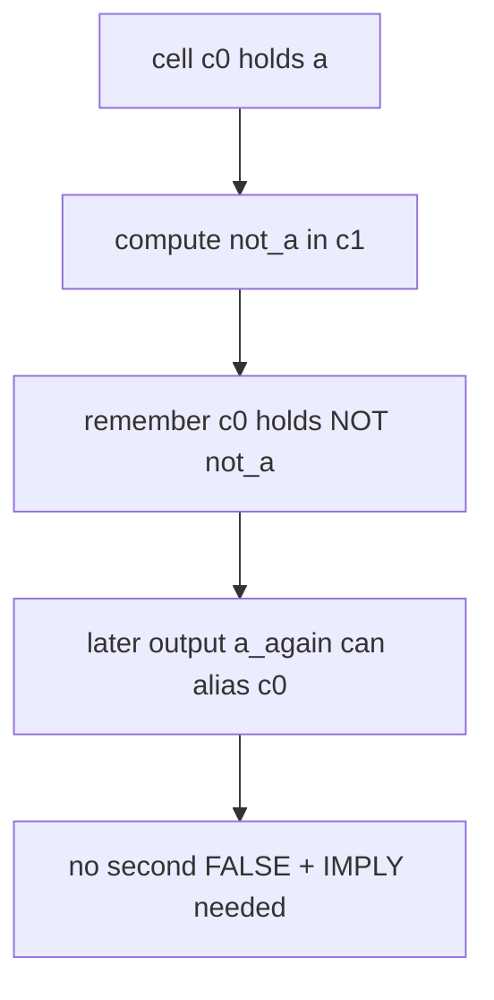
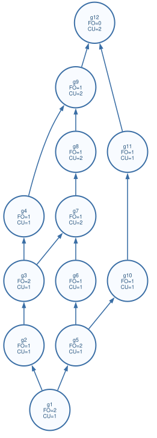
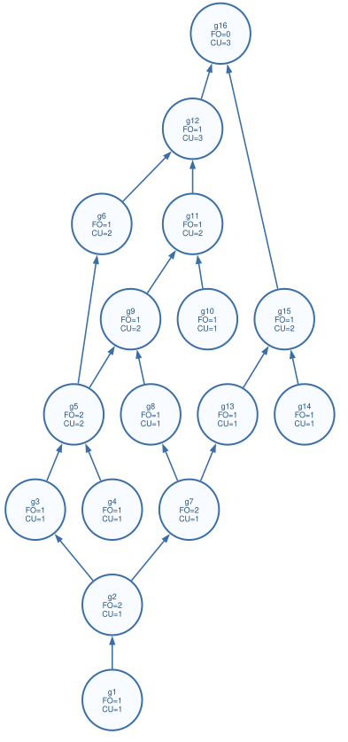

# Sequencing Optimization Report

This note is the short diff walkthrough for the next Fabian meeting.

It explains what changed after the first ISCAS'85 run, why the sequencing result
improved, and which tradeoff is still open.

## 1. Starting Point

Fabian's latest feedback had two practical requests:

- Run the system on ISCAS'85.
- Expose `FALSE` operations clearly enough that the scheduler can combine or
  reuse reset-related structure instead of treating every reset as isolated.

The baseline run used the current `compile.py` flow before the sequencer change:

```text
Verilog -> Yosys -> ABC adapter netlist
        -> ZERO/IMPLY primitive graph
        -> sequencer
        -> IMPLY/FALSE pulse sequence
```

For the main explanatory case, the old result was:

| circuit | before optimized sequence |
|---|---:|
| `full_adder` | 26 steps / 7 cells |
| `c17` | 20 steps / 7 cells |

## 2. Problem in the Old Sequencer

The primitive graph already represents each inverter as real target primitives:

```text
INV x
  -> ZERO z
  -> IMPLY x, z
```

That is logically correct, and it keeps the project-facing graph restricted to
`ZERO/CONST0 + IMPLY`.

The missing scheduling insight was that this primitive shape is still an
inversion. Once the scheduler sees:

```text
ZERO z
IMPLY x -> z
```

it should remember:

```text
z = NOT x
x = NOT z
```

The old code computed the correct pulses, but it reclaimed the reverse alias too
early. A later `NOT z` therefore emitted another `FALSE + IMPLY`, even when the
old cell already still held `x`.

## 3. New Sequencing Idea

The new sequencer does two small things.

First, in optimized mode it recognizes single-use primitive inverter shapes:


Second, cell reclamation now keeps a cached inverse alive while the net whose
inverse it represents may still be useful.



The final emitted program is still only hardware-real operations:

```text
FALSE [...]
IMPLY src -> dst
```

No `INV` is emitted as a pulse.

## 4. Full-Adder Result

The full adder now drops from 26 to 20 steps.

| metric | before | after |
|---|---:|---:|
| optimized steps | 26 | 20 |
| cells | 7 | 7 |
| `FALSE` pulses | 7 | 4 |
| `IMPLY` pulses | 19 | 16 |

The updated schedule is generated from the actual sequence artifact:


The dependency graph views are still available for explaining the adapter and
primitive stages:





## 5. ISCAS'85 Before/After

Source circuits were taken from Fabian's suggested benchmark repository:

```text
https://github.com/santoshsmalagi/Benchmarks/tree/main/ISCAS85
```

The first table is the baseline before the sequencer change. The second table is
the run after the change. Both use the same `compile.py` checks.

| circuit | before opt | after opt | delta | cells before -> after | status |
|---|---:|---:|---:|---:|---|
| `c1355` | 960 | 888 | -72 (7.5% fewer) | 119 -> 229 | PASS |
| `c17` | 20 | 15 | -5 (25.0% fewer) | 7 -> 8 | PASS |
| `c1908` | 958 | 807 | -151 (15.8% fewer) | 152 -> 208 | PASS |
| `c2670` | 1358 | 1235 | -123 (9.1% fewer) | 282 -> 367 | PASS |
| `c3540` | 2174 | 1981 | -193 (8.9% fewer) | 236 -> 323 | PASS |
| `c432` | 336 | 243 | -93 (27.7% fewer) | 56 -> 72 | PASS |
| `c499` | 1013 | 885 | -128 (12.6% fewer) | 133 -> 228 | PASS |
| `c5315` | 3142 | 2867 | -275 (8.8% fewer) | 483 -> 640 | PASS |
| `c6288` | 4930 | 4616 | -314 (6.4% fewer) | 724 -> 741 | PASS |
| `c7552` | 3583 | 3190 | -393 (11.0% fewer) | 564 -> 717 | PASS |
| `c880` | 716 | 631 | -85 (11.9% fewer) | 131 -> 160 | PASS |

The full generated result tables are not checked in (regenerate them anytime
with the command in §8 below); the table above has the complete numbers.

## 6. Local Benchmark Check

The local small-circuit benchmark also improves.

| circuit | naive steps | opt steps | cells | verify |
|---|---:|---:|---:|---|
| `full_adder` | 48 | 20 | 7 | OK |
| `ripple4` | 223 | 91 | 25 | OK |
| `mult2x2` | 54 | 23 | 11 | OK |
| `mux4` | 57 | 22 | 11 | OK |
| `c17` | 38 | 15 | 8 | OK |
| `ripple8` | 463 | 199 | 49 | OK |

The full local table regenerates with `python3 synthesis/benchmark.py`
(writes to `output/benchmark/benchmark_report.md`, not checked in).

## 7. Tradeoff

This optimization reduces pulses by keeping more inverse aliases alive.

The benefit is fewer `FALSE + IMPLY` recomputations.

The cost is higher cell pressure on many ISCAS'85 circuits.

That is a real design tradeoff:

```text
more cached inverse values -> fewer pulses, more cells
fewer cached inverse values -> more pulses, fewer cells
```

For the meeting, the useful question is:

> Should the final scheduler optimize primarily for step count, or should it
> expose a step/cell Pareto mode for the final evaluation?

## 8. How to Reproduce

Run the local checks:

```bash
cd <repo root>
python3 synthesis/compile.py synthesis/circuits/full_adder.v
python3 synthesis/compile.py synthesis/circuits/ISCAS85/c17.v
python3 -m pytest synthesis/tests -q
```

Compile one circuit and draw its scheduling graph:

This snippet is written for the VS Code `fish` terminal.

```fish
set SRC synthesis/circuits/ISCAS85/c432.v
  set CIRCUIT (basename $SRC .v)

  python3 synthesis/compile.py $SRC
  python3 synthesis/render_schedule_svg.py \
        "synthesis/compiled/$CIRCUIT/$CIRCUIT.seq.txt" \
        "docs/assets/iscas85/$CIRCUIT"_schedule.svg \
        --drawio "docs/assets/iscas85/$CIRCUIT"_schedule.drawio \
        --title "$CIRCUIT IMPLY/FALSE schedule"
circuit : c432  (36 inputs, 7 outputs)
abc map : 121 IMPLY + 61 INV
primitive: 182 IMPLY + 61 ZERO
steps   : naive 971  ->  opt 243   (cells 72)
  PASS  abc-mapping == source (formal cec)
  PASS  primitive graph == mapped netlist (formal cec)
  PASS  opt sequence == primitive graph (formal cec)
  PASS  naive sequence == primitive graph (formal cec)
  PASS  simulator sanity (1000 vectors)
sequence: /Users/apple/Library/Mobile Documents/com~apple~CloudDocs/海德堡大学/2026ss/mcc/src/synthesis/compiled/c432/c432.seq.txt
```

To draw another circuit, change only the `set SRC ...` line.

For example, use `set SRC synthesis/circuits/arithmetic/full_adder.v` for the
local full adder, or `set SRC synthesis/circuits/ISCAS85/c432.v` for
ISCAS'85 `c432`.

Run ISCAS'85 from the checked-in benchmark copy:

The checked-in layout is flat: `synthesis/circuits/ISCAS85/<circuit>.v`.

```bash
python3 synthesis/run_iscas85.py synthesis/circuits/ISCAS85
# writes to output/iscas85/iscas85_results.{csv,md} by default
```
